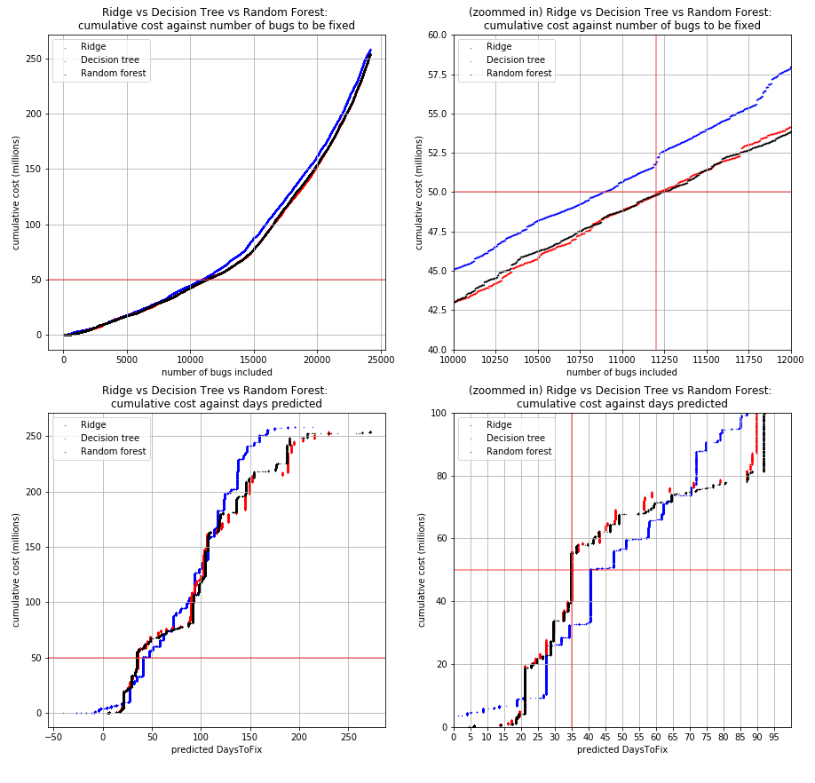

# bugfixtime
Predicting how many days it would take to fix a bug, given the Jira information when the bug is filed.

## Motivation
Bugs and software develeopment are inseparable. Also, having bugs in software products implies that at least some man-hour need to be assigned to address them. According to [a study in 2002 by America's National Institute of Standards and Technology (NIST)](http://www.abeacha.com/NIST_press_release_bugs_cost.htm), software bugs cost the U.S. economy an estimated **$59.5 billion** annually, or about 0.6 percent of the gross domestic product. It is almost impossible to expect no bug at all, hence, the second best alternative appears to be knowing how much work is needed to fix them so resources can be maanged efficiently.  
This project attempts to chip away at that problem by trying to predict how many days it would take to fix a bug, given their metadata when they are filed in Jira.

## Dataset
The data used in this study is obtained from the research article titled [From Reports to Bug-Fix Commits: A 10
Years Dataset of Bug-Fixing Activity from 55 Apache's Open Source Projects](https://dl.acm.org/doi/10.1145/3345629.3345639) by Vieira, Da Silva, Rocha, and Gomes in 2019. The data is
housed [here](https://figshare.com/articles/Replication_Package_-_PROMISE_19/8852084).  
Contained within is a dataset composed of more than 70,000 bug-fix reports from 10 years of bug-fixing activity
of 55 projects from the Apache Software Foundation along with their Jira data and status.

### License terms
The dataset is licensed under CC BY 4.0.  
No modifications were made to the data hosted here. The CSV file hosted in this repository is one of the many files created by the script `mining-script.py`.

### Data Processing
Running `mining-script.py` as specified by the README file in the research article generates 3 CSV files for each of the 55 Apache Software project. The data used in here is a appended table created from the `<projectname>-jira-bug-fix-dataset` file from each project.

## Findings
3 types of model were deployed in this study,
- Linear regression with L2 regularization (ridge regression)
- Decision Tree
- Random Forest (ensemble of multiple decision trees)

For 39,488 bugs in the test set,
- Ridge Regression root mean squared error: 187.55
- Decision Tree root mean squared error: 186.65
- Random Forest root mean squared error: 186.57
Based on the errors alone, Random Forest appears to be the best choice, with the smallest error among the models attempted.

## Plot of predicted DaysToFix vs actual DaysToFix - Random Forest
Comparing the predicted values against the actual values. This gives a quick overview of the quality of predictions.

### Utility Function
Implementing a utility function in a hypothetical situation.  
Over-prediction would cost $100 excess spending per day.  
Under-prediction would cost $150 excess spending per day.  
With this imbalanced cost function,  
Total excess spending using ridge regression model: $258,350,050
Total excess spending using decision tree model: $253,309,100
Total excess spending using random forest model: $253,462,250
Total excess spending using just the mean value (64 days) as the predicted variable: $272,283,700

### Scenario - Limited Budget
Assuming a limited budget of $50 million, Apache foundation can choose to only address bugs that are predicted to take 35 days or less. The visualization behind this decision is shown below.

